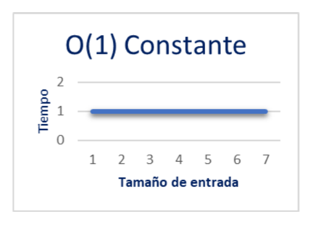
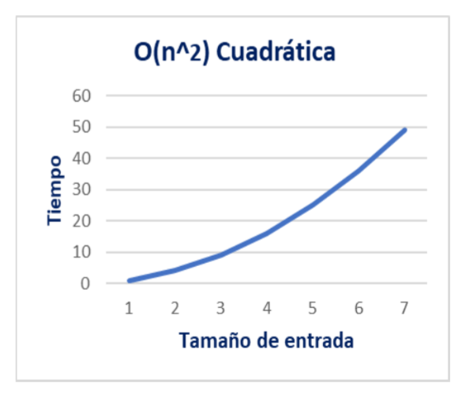
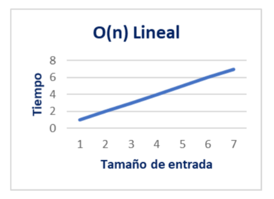
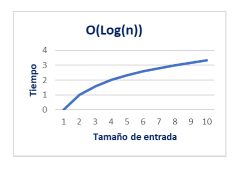

# 📈 Notación Big O

La notación **Big O** se utiliza para describir el **comportamiento de los algoritmos** en términos de eficiencia, especialmente en relación con el **tamaño de la entrada**.

---

## 🧠 ¿Qué representa la "n"?

- **"n"** representa el **tamaño de la entrada**.
- Por ejemplo, si estás ordenando un arreglo de 100 elementos, entonces **n = 100**.
- La notación Big O describe cómo **crece el tiempo o espacio requerido** por el algoritmo a medida que **n aumenta**.

---

## 🧮 Tipos comunes de complejidad

| Notación | Nombre | Descripción | Ejemplo típico |
|---------|--------|-------------|----------------|
| `O(1)` | Constante | No depende del tamaño de la entrada | Acceso directo a un elemento en un arreglo |
| `O(log n)` | Logarítmica | Crece lentamente con n | Búsqueda binaria |
| `O(n)` | Lineal | Crece proporcionalmente a n | Recorrer un arreglo |
| `O(n log n)` | Lineal-logarítmica | Más eficiente que cuadrática | Merge Sort, Quick Sort |
| `O(n²)` | Cuadrática | Tiempo crece rápidamente | Algoritmos de ordenamiento simples como Bubble Sort |
| `O(2ⁿ)` | Exponencial | Muy costoso para entradas grandes | Algoritmos de fuerza bruta |
| `O(n!)` | Factorial | Extremadamente ineficiente | Algoritmos de permutación completa |

---

## 📊 Gráfica de tipos

---

## 🗒️ Tipos de análisis

- **Mejor caso (`Best Case`)**: El escenario más favorable.
- **Peor caso (`Worst Case`)**: El escenario más desfavorable.
- **Caso promedio (`Average Case`)**: Lo que ocurre típicamente.

---

## 🧩 ¿Qué mide Big O?

- **Tiempo de ejecución**: Cuánto tarda el algoritmo en completarse.
- **Uso de memoria**: Cuánta memoria adicional necesita.

---

## 📌 Consejos para interpretar Big O

- Ignora constantes: O(2n) se considera O(n).
- Se enfoca en el crecimiento: No mide tiempo exacto, sino cómo escala.
- Compara algoritmos: Ayuda a elegir el más eficiente para grandes volúmenes de datos.
