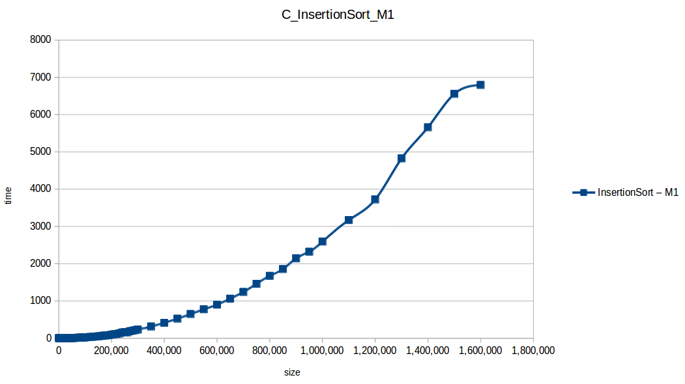
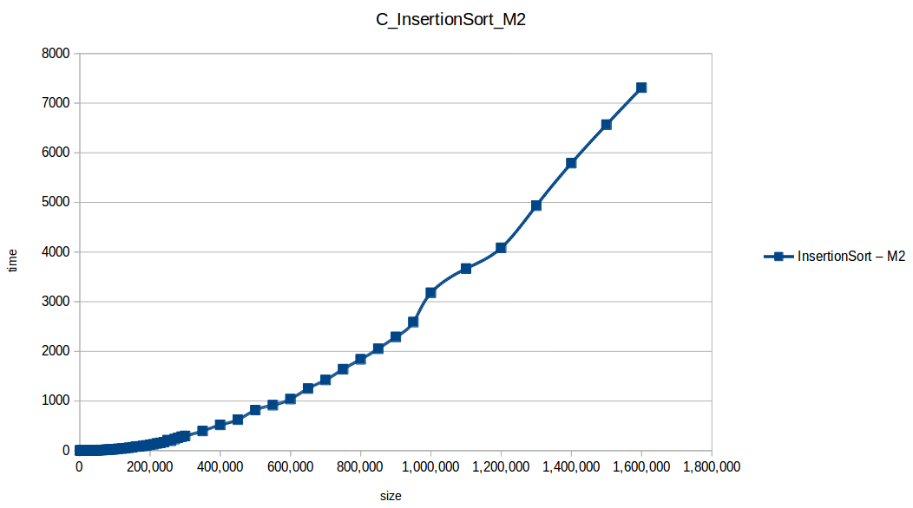
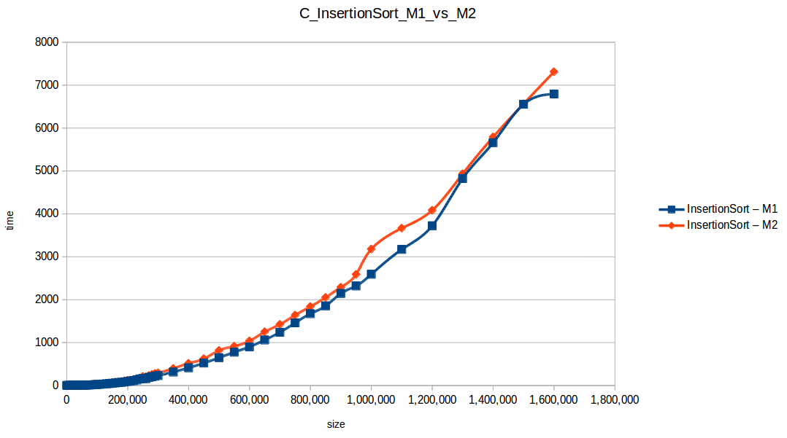

# Algoritmo de Ordenamiento por Inserción (Insertion Sort)

## 📌 Descripción

El **ordenamiento por inserción** es un algoritmo de tipo **interno** y **directo**, ideal para conjuntos de datos pequeños o casi ordenados. Funciona de manera similar a cómo ordenarías cartas en tu mano: insertando cada elemento en su posición correcta respecto a los anteriores.

---

## 🧩 Tipo de algoritmo

- Tipo: Ordenamiento interno
- Clasificación: Algoritmo directo
- Estabilidad: Estable (no cambia el orden de elementos iguales)
- In-place: Sí (no requiere memoria adicional significativa)

---

## ⚙️ Lógica del Algoritmo

1. Comienza desde el segundo elemento del arreglo.
2. Compara el elemento actual con los anteriores.
3. Desplaza los elementos mayores hacia la derecha.
4. Inserta el elemento en la posición correcta.


---

## 📊 Complejidad (Big O)

| Caso | Tiempo |
|------|--------|
| Mejor caso (ya ordenado) | O(n) |
| Peor caso (orden inverso) | O(n²) |
| Espacio | O(1) (in-place) |





---

## 🧪 Casos donde es eficiente

- Arreglos **pequeños**.
- Arreglos **casi ordenados**.
- Cuando se requiere un algoritmo **simple y fácil de implementar**.
- En sistemas donde el **costo de intercambio** es bajo.

---

## 💻 Código en Java

```java
public class InsertionSort {
    public static void insertionSort(int[] arr) {
        for (int i = 1; i < arr.length; i++) {
            int key = arr[i];
            int j = i - 1;

            // Mueve los elementos mayores que key una posición adelante
            while (j >= 0 && arr[j] > key) {
                arr[j + 1] = arr[j];
                j--;
            }

            arr[j + 1] = key;
        }
    }

    public static void main(String[] args) {
        int[] data = {9, 5, 1, 4, 3};
        System.out.println("Array original:");
        printArray(data);

        insertionSort(data);

        System.out.println("Array ordenado:");
        printArray(data);
    }

    public static void printArray(int[] arr) {
        for (int num : arr) {
            System.out.print(num + " ");
        }
        System.out.println();
    }
}
```

---

## 🖥️ Salida esperada en consola

``` shell
Array original: 9 5 1 4 3 
Array ordenado: 1 3 4 5 9 
```

---

## 🔄 Iteraciones del Insertion Sort

### 🔹 Estado inicial

```shell
  [9, 5, 1, 4, 3]
```

### 🔁 Iteración 1 (i = 1, key = 5)

- Compara 5 con 9 → 9 es mayor, se desplaza.
- Inserta 5 en la posición 0.

```shell
  [5, 9, 1, 4, 3]
```

### 🔁 Iteración 2 (i = 2, key = 1)

- Compara 1 con 9 → 9 se desplaza.
- Compara 1 con 5 → 5 se desplaza.
- Inserta 1 en la posición 0.

```shell
  [1, 5, 9, 4, 3]
```

### 🔁 Iteración 3 (i = 3, key = 4)

- Compara 4 con 9 → 9 se desplaza.
- Compara 4 con 5 → 5 se desplaza.
- Inserta 4 en la posición 1.

```shell
  [1, 4, 5, 9, 3]
```

### 🔁 Iteración 4 (i = 4, key = 3)

- Compara 3 con 9 → 9 se desplaza.
- Compara 3 con 5 → 5 se desplaza.
- Compara 3 con 4 → 4 se desplaza.
- Inserta 3 en la posición 1.

```shell
  [1, 3, 4, 5, 9]
```

### ✅ Resultado final

```shell
  [1, 3, 4, 5, 9]
```