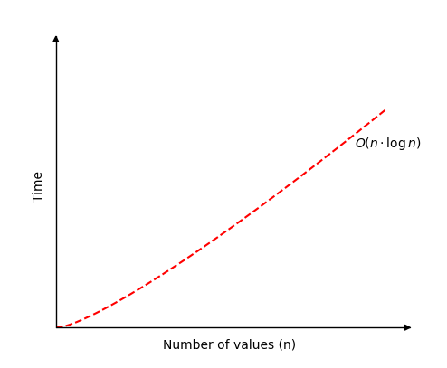

# Algoritmo de Ordenamiento por Montículo (Heap Sort)

## 📌 Descripción

El Heap Sort es un algoritmo de ordenamiento basado en la estructura de datos llamada montículo (heap), que se representa como un árbol binario completo. 

Está basado en la Estructura de Datos de Montículo Binario (BIN) . Se puede considerar una optimización del ordenamiento por selección , donde primero se busca el elemento máximo (o mínimo) y se intercambia con el último (o primero). Se repite el mismo proceso para los elementos restantes. En el ordenamiento por montículo, se utiliza el montículo binario para encontrar y mover rápidamente el elemento máximo en O(Log n) en lugar de O(n), logrando así una complejidad temporal de O(n Log n).

Es un algoritmo eficiente y muy usado en escenarios donde se requieren ordenamientos rápidos sin memoria adicional significativa.

___

## 🧩 Tipo de algoritmo

- Tipo: Ordenamiento interno
- Clasificación: Basado en montículo (estructura de datos)
- Estabilidad: No estable (puede alterar el orden de elementos iguales)
- In-place: Sí (no requiere memoria adicional significativa)

___

## ⚙️ Lógica del Algoritmo

1. Construir un max-heap a partir del arreglo.
2. Intercambiar el primer elemento (máximo) con el último elemento del heap.
3. Reducir el tamaño del heap en 1.
4. Aplicar heapify para restaurar el heap.
5. Repetir hasta que el heap tenga tamaño 1.

> [!NOTE]  
> Heap Sort es más eficiente que los métodos directos (como Burbuja o Selección), pero suele ser superado por Quick Sort en la práctica debido a la mejor localización de caché de este último.


___

## 📊 Complejidad (Big O)

| Caso | Tiempo |
|------|--------|
| Mejor caso | O(n log n) |
| Peor caso | O(n log n) |
| Promedio | O(n log n) |
| Espacio | O(1) (in-place) |



___

## 🧪 Casos donde es eficiente

- Cuando se requiere un rendimiento garantizado de O(n log n) en todos los casos.
- En sistemas con memoria limitada, ya que es in-place.
- En escenarios donde se necesita un ordenamiento sin depender del orden inicial de los datos.

___

## 💻 Código en Java

```java
public class HeapSort {

    // Método principal de heap sort
    public static void heapSort(int[] arr) {
        int n = arr.length;

        // Construir el max-heap
        for (int i = n / 2 - 1; i >= 0; i--) {
            heapify(arr, n, i);
        }

        // Extraer elementos del heap uno por uno
        for (int i = n - 1; i > 0; i--) {
            // Mover la raíz (máximo) al final
            int temp = arr[0];
            arr[0] = arr[i];
            arr[i] = temp;

            // Restaurar el heap en el arreglo reducido
            heapify(arr, i, 0);
        }
    }

    // Función para mantener la propiedad de max-heap
    public static void heapify(int[] arr, int n, int i) {
        int largest = i; // raíz
        int left = 2 * i + 1; // hijo izquierdo
        int right = 2 * i + 2; // hijo derecho

        // Si el hijo izquierdo es mayor que la raíz
        if (left < n && arr[left] > arr[largest]) {
            largest = left;
        }

        // Si el hijo derecho es mayor que el mayor hasta ahora
        if (right < n && arr[right] > arr[largest]) {
            largest = right;
        }

        // Si el mayor no es la raíz
        if (largest != i) {
            int swap = arr[i];
            arr[i] = arr[largest];
            arr[largest] = swap;

            // Recursivamente heapify en el subárbol afectado
            heapify(arr, n, largest);
        }
    }

    // Método auxiliar para imprimir el arreglo
    public static void printArray(int[] arr) {
        for (int num : arr) {
            System.out.print(num + " ");
        }
        System.out.println();
    }

    public static void main(String[] args) {
        int[] data = {9, 5, 1, 4, 3};
        System.out.println("Array original:");
        printArray(data);

        heapSort(data);

        System.out.println("Array ordenado:");
        printArray(data);
    }
}
```

## 🖥️ Salida esperada en consola

```shell
Array original: 9 5 1 4 3 
Array ordenado: 1 3 4 5 9 
```

## 🔄 Iteraciones del Heap Sort

### 🔹 Estado inicial

```shell
  [9, 5, 1, 4, 3]
```

### 🔁 Paso 1: Construcción del max-heap

- El arreglo se reorganiza como un max-heap:

```shell
  [9, 5, 1, 4, 3]   →   [9, 5, 1, 4, 3] (ya cumple la propiedad de heap)
```

### 🔁 Paso 2: Intercambio raíz ↔ último

- Intercambia 9 con 3.
- Heapify sobre los primeros 4 elementos.

```shell
  [3, 5, 1, 4, 9]   →   [5, 4, 1, 3, 9]
```

### 🔁 Paso 3: Repite el proceso

- Intercambia 5 con 3.
- Heapify sobre los primeros 3 elementos.

```shell
  [3, 4, 1, 5, 9]   →   [4, 3, 1, 5, 9]
```

### 🔁 Paso 4: Intercambia raíz ↔ último del heap reducido

```shell
  [1, 3, 4, 5, 9]
```

### ✅ Resultado final

```shell
  [1, 3, 4, 5, 9]
```
